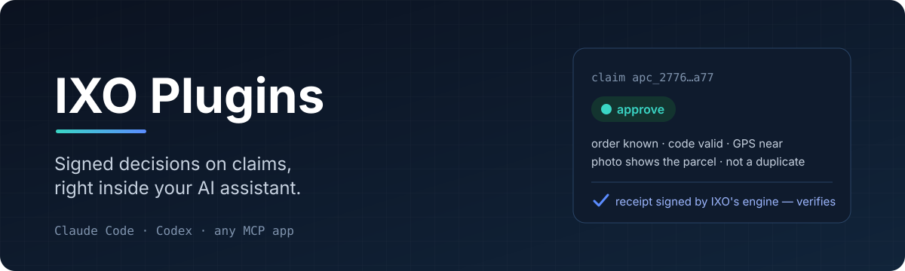
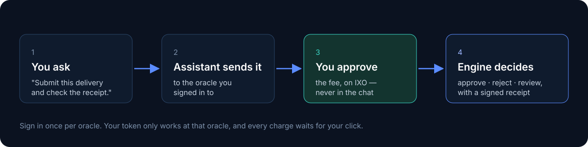

<p align="center">
  
</p>

<p align="center">
  <a href="https://github.com/ixoworld/ixo-plugins/actions/workflows/validate.yml"></a>
  
  
  
</p>

Sometimes you need someone neutral to say *"yes, this really happened."* A courier says the parcel
was delivered. A farmer says the trees were planted. An agent says the job was done.

**IXO oracles** check claims like these against a published set of rules and give you a decision —
`approve`, `reject` or `review` — signed by IXO's decision engine, so anyone can check it later.

These plugins put that inside your AI assistant. You say what you want in plain words; the assistant
reads what the oracle needs, sends the claim, asks you to approve the fee, and comes back with the
decision and a receipt you can verify.

<p align="center">
  
</p>

## Get started

Add the marketplace once, then install the oracle you want.

**Claude Code**

```text
/plugin marketplace add ixoworld/ixo-plugins
/plugin install ixo-swiftdrop-devnet@ixo-plugins
```

Then run `/mcp`, pick `plugin:ixo-swiftdrop-devnet:ixo-shipment-delivery`, and choose
**Authenticate**. Your browser opens IXO's sign-in page — sign in and click **Allow**. That's it.

**Codex**

```bash
codex plugin marketplace add ixoworld/ixo-plugins
codex plugin add ixo-swiftdrop-devnet@ixo-plugins
```

Codex asks you to sign in with IXO when you install. If it doesn't, run `codex mcp list` and
`codex mcp login` with the oracle's server name.

**Claude.ai, Claude Desktop, ChatGPT and other apps**

You don't need a plugin there. Add the oracle as a custom connector with its URL and sign in when
asked:

```text
https://shipment-delivery-oracle.devnet.ixo.earth/v1/mcp
```

In Claude it's *Settings → Connectors → Add custom connector*. In ChatGPT it's *Settings → Apps &
Connectors* in developer mode (on a Pro plan, developer mode only runs the read tools).

## Oracles you can install

| Plugin | What it decides | Network |
| --- | --- | --- |
| [`ixo-swiftdrop-devnet`](plugins/ixo-swiftdrop-devnet) | Proof of delivery for SwiftDrop Express couriers | devnet — for testing |

More are coming. Each oracle is its own plugin, because your sign-in for one oracle only ever works
at that oracle — so you install only the ones you actually use.

## Then just ask

> *"Am I set up to get SwiftDrop decisions?"* — checks your sign-in and what it costs, without
> paying anything.
>
> *"Submit a delivery for order ORD-1042: delivered, code 7420, here's the photo: https://…"*
>
> *"Is the receipt for that claim genuine?"*

The plugin comes with three skills that teach the assistant how to do this properly:
**submit-claim**, **verify-decision**, and **can-we-pay** (which only reads — it never submits or
pays).

## Your money, your call

Nothing gets charged without you.

- **You approve every claim.** Before anything costs money, IXO shows you the oracle, the app and
  the exact price on its own page. You click **Approve** there — the assistant can't do it for you.
- **Or set your own limits.** On the approve page you can tick *"don't ask again"* for a trusted
  app, with a per-claim limit, a total (up to $100) and an end date (up to 7 days). You can change
  it or turn it off any time.
- **There's a daily ceiling.** An app never spends more than $20 a day through IXO.
- **You can cut an app off.** Disconnect it from IXO's *Connected apps* page.

The fee pays for the decision. It's not a payout to anyone — and a decision on its own doesn't mean
anyone is allowed to act on it. That's still up to your own rules.

## What the assistant can do

| Tool | In plain words |
| --- | --- |
| `list_protocols` | What you can submit and what it costs — or exactly what one kind of claim needs. |
| `submit_claim` | Sends a claim and waits up to 90 seconds for the decision. Asks for your approval first. Safe to retry. |
| `get_decision` | Looks up a decision, any review that's pending, and the payment. Never shows your answers back. |
| `verify_receipt` | Checks a decision's signed receipt, by claim id or from a receipt you already have. |

## If something's off

- **It asks you to upload a photo.** There's no upload — give it a link to the photo (`https://…`).
- **It shows you an "approve" link.** Open it, check the price, approve, then tell it to carry on.
- **The app won't run `submit_claim`.** Some apps hold back tools that might spend money. Allow just
  that one tool (in Claude Code: `/permissions` → Allow →
  `mcp__plugin_ixo-swiftdrop-devnet_ixo-shipment-delivery__submit_claim`). Please don't switch your
  app's safety checks off — you don't need to, since every charge still waits for you anyway.
- **"Choose a source."** You belong to more than one workspace on that oracle — tell it which one.
- **"No source."** You need a workspace on that oracle that you own. Create one in its Decision
  Console.
- **Your card wants 3-D Secure.** Open the bank's link it shows you, confirm, and tell it to continue.
- **Sign-in fails.** Run `/mcp` (Claude Code) or `codex mcp login` (Codex) again. You'll need an IXO
  account.

## For oracle operators

Every plugin here is built from the same skills in [`template/`](template). Adding yours is one
command:

```bash
bun run add-oracle --name <plugin-name> --title "<Your oracle>" \
  --url https://<your oracle>/v1/mcp --description "<one line about what it decides>"
bun run validate
```

That writes `plugins/<plugin-name>/` with everything Claude Code and Codex need, and lists it in
both marketplaces. A plugin only ever holds your oracle's public URL — never a key. See
[CONTRIBUTING.md](CONTRIBUTING.md), then open a pull request and the IXO team will review it.

## Security

Found something? Please report it privately — see [SECURITY.md](SECURITY.md).

---

<p align="center"><sub>Made by <a href="https://ixo.world">IXO</a>. Oracles don't decide anything themselves — IXO's decision engine does, against each protocol's published rules, and signs every result.</sub></p>
